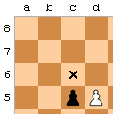

# Definition of the communication protocol

### Microcontroller -> Server

| Command  | Byte 1<br />(Controlbyte) | Byte 2 | Byte 3 | Byte 4 | Byte 5 | Description |                              |
| -------- | ------ | ------ | ------ | ------ | ------ | ---------------------------- | ---------------------------- |
| Start    | 1      | 0 / 1  |        |        |        | Byte 2 = 0 => PvP<br />Byte 2 = 1 => PvEngine | [Start](#MC_Start) |
| Reset    | 3      |        |        |        |        |  |                              |
| New Turn | 10     | Ax     | Ay     | Bx     | By     | Byte 2 + 3 => Startfield (A)<br />Byte 3 + 4 => Endfield (B) | [New Turn](#MC_NewTurn)                             |
| Promotion Ack | 15 | [Figure](#Def_Figures) |  |  |  | Byte 2 = Figure to replace the pawn |  |
| Error    | 255    |        |        |        |        |        |                              |


#### Examples

##### <a name="MC_Start"></a>Start

| Case              | Byte 1 | Byte 2 |
| ----------------- | ------ | ------ |
| Player vs. Player | 1      | 0      |
| Player vs. Engine | 1      | 1      |


##### <a name="MC_NewTurn"></a>NewTurn

| Case               | Byte 1 | Byte 2 | Byte 3 | Byte 4 | Byte 5 |
| ------------------ | ------ | ------ | ------ | ------ | ------ |
| Move from A1 to A2 | 10     | 0      | 0      | 0      | 1      |
| Move from B8 to C8 | 10     | 1      | 7      | 2      | 7      |


### Server -> Microcontroller

The server answers a command of the MC with a new command and an enclosed AI move (if the last player move was legal).

| Command    | Byte 1 | Byte 2 | Byte 3 | Byte 4 | Byte 5 | AI moves enclosed | Example            |
| ---------- | ------ | ------ | ------ | ------ | ------ | ----------------- | ------------------ |
| OK         | 0      |        |        |        |        | X                 |  |
| Castling   | 1      | RAx    | RAy    | RBx    | RBy    | X                 | [Castling](#Srv_Castling)                   |
| En passant | 2      | Px     | Py     |        |        | X                 | [En passant](#Srv_EnPassant)                   |
| Promotion  | 3      | Px     | Py     |        |        | X                 | [Promotion](#Srv_Promotion)                   |
| Check      | 10     | Kx     | Ky     |        |        | X                 | [Check](#Srv_Check)                   |
| Checkmate  | 20     | Kx     | Ky     |        |        |                   | [Checkmate](#Srv_Checkmate)                   |
| Illegal    | 99     | Bx     | By     | Ax     | Ay     |                   | [Illegal](#Srv_Illegal) |
| Error      | 255    |        |        |        |        |                   |                |


#### Examples

##### <a name="Srv_Castling"></a>Castling

- Short castling white (King E1G1)

  - 

    - (Wikimedia) [^1]

  - ```
    1 7 0 5 0   + next AI move
    ```

- Long castling white (King E1C1)

  - 

    - (Wikimedia)[^2]

  - ```
    1 0 0 3 0   + next AI move
    ```


##### <a name="Srv_EnPassant"></a>En passant

- Pawn D5C6 (After Pawn C7C5)

  - 

    - (Wikimedia) [^3]

  - ```
    2 2 4   + next AI move
    ```


##### <a name="Srv_Promotion"></a>Promotion

- Pawn A7A8 (becomes Queen)

  - ```
    3 0 7   + next AI move
    ```

- Pawn H2H1 (becomes Knight)

  - ```
    3 7 0   + next AI move
    ```

The server has to wait for a Promotion Ack-command by the MC after sending this.


##### <a name="Srv_Check"></a>Check

- Rook A2C2 (checks King C6)

  - ```
    10 2 5   + next AI move
    ```


##### <a name="Srv_Checkmate"></a>Checkmate

- Queen D8H4 (checkmates King E1)

  - ```
    20 4 0
    ```


##### <a name="Srv_Illegal"></a>Illegal

- Pawn A2A1 (which is an illegal move)

  - ```
    99 0 0 0 1
    ```


#### AI moves

| Command           | Byte 1 | Byte 2 | Byte 3 | Byte 4 | Byte 5 | Byte 6 | Byte 7 | Byte 8 | Byte 9 | Example                 |
| ----------------- | ------ | -------- | -------- | -------- | -------- | ----------------------- | ----------------------- | ----------------------- | ----------------------- | ----------------------- |
| OK (regular move) | 0      | Ax       | Ay       | Bx       | By       |        |        |        |        | [OK](#AI_OK) |
| Castling          | 1      | KAx    | KAy    | KBx    | KBy    | RAx   | RAy   | RBx   | RBy   | [Castling](#AI_Castling)  |
| En passant        | 2      | Ax     | Ay     | Bx | By | Px | Py     |        |          | [En passant](#AI_EnPassant)  |
| Promotion         | 3      | Ax     | Ay     | Bx     | By | [Figure](#Def_Figures) |  |        |          | [Promotion](#AI_Promotion) |
| Check             | 10     | Ax     | Ay     | Bx | By | Kx | Ky     |        |          | [Check](#AI_Check)  |
| Checkmate         | 20     | Ax     | Ay     | Bx | By | Kx | Ky     |        |          | [Checkmate](#AI_Checkmate) |


##### AI moves examples

###### <a name="AI_OK"></a>OK (regular move)

- A1A2

  - ```
    0 0 0 0 1
    ```

- B8C8

  - ```
    0 1 7 2 7
    ```


###### <a name="AI_Castling"></a>Castling

- Short castling white (King E1G1)

  - 

    - (Wikimedia) [^1]

  - ```
    1 4 0 6 0 7 0 5 0
    ```

- Long castling white (King E1C1)

  -   

    -   (Wikimedia)[^2]

  - ```
    1 4 0 2 0 0 0 3 0
    ```


###### <a name="AI_EnPassant"></a>En passant

- Pawn D5C6 (After Pawn C7C5)

  -   

    - (Wikimedia) [^3]

  - ```
    2 3 5 2 6 2 4
    ```


###### <a name="AI_Promotion"></a>Promotion

- Pawn A7A8 (becomes Queen)

  - ```
    3 0 6 0 7 Q
    ```

- Pawn H2H1 (becomes Knight)

  - ```
    3 7 1 7 0 N
    ```


###### <a name="AI_Check"></a>Check

- Rook A2C2 (checks King C6)

  - ```
    10 0 1 2 1 2 5
    ```


###### <a name="AI_Checkmate"></a>Checkmate

- Queen D8H4 (checkmates King E1)

  - ```
    20 3 7 7 3 4 0
    ```


### Definitions

#### <a name="Def_Figures"></a>Figures

| Figure | Char | ASCII (Dec) | ASCII (Hex) |
| ------ | ---- | ----------- | ----------- |
| Pawn   | P    | 80          | 50          |
| Knight | N    | 78          | 4E          |
| Bishop | B    | 66          | 42          |
| Rook   | R    | 82          | 52          |
| Queen  | Q    | 81          | 51          |
| King   | K    | 75          | 4B          |


### Sources

[^1]: <a href="http://creativecommons.org/licenses/by-sa/3.0/" title="Creative Commons Attribution-Share Alike 3.0">CC BY-SA 3.0</a>, <a href="https://commons.wikimedia.org/w/index.php?curid=278291">Link</a>

[^2]: <a href="http://creativecommons.org/licenses/by-sa/3.0/" title="Creative Commons Attribution-Share Alike 3.0">CC BY-SA 3.0</a>, <a href="https://commons.wikimedia.org/w/index.php?curid=278294">Link</a>

[^3]: <a href="http://creativecommons.org/licenses/by-sa/3.0/" title="Creative Commons Attribution-Share Alike 3.0">CC BY-SA 3.0</a>, <a href="https://commons.wikimedia.org/w/index.php?curid=278302">Link</a> 
