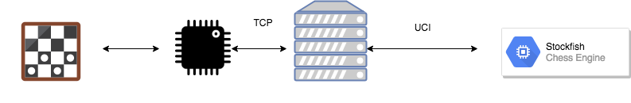
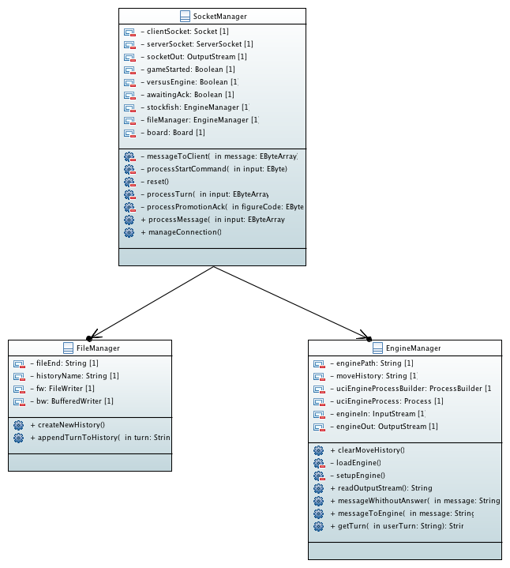
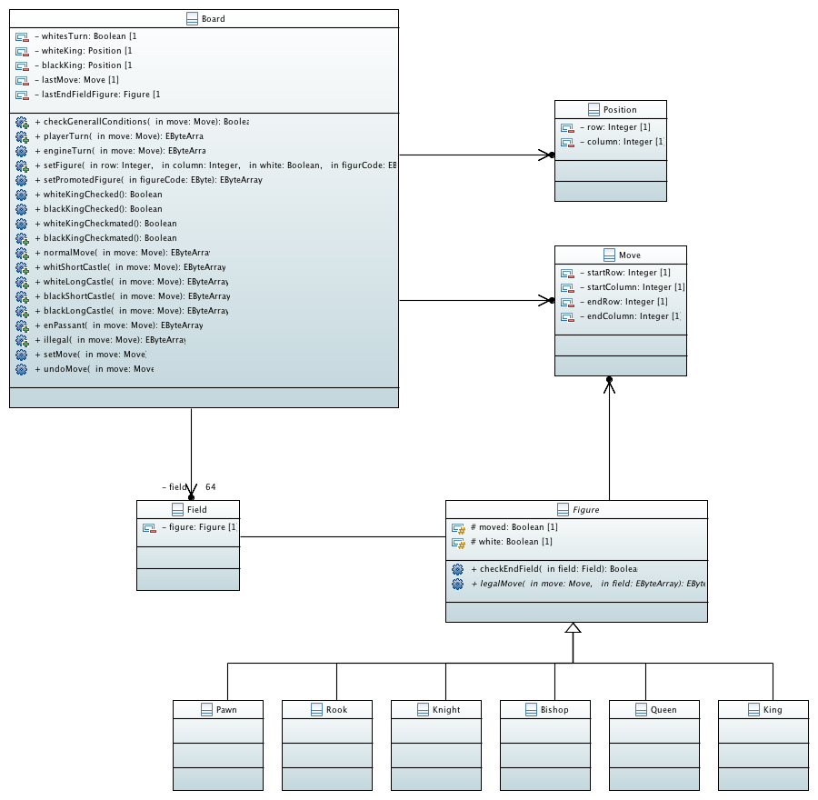

# intelligentes-schachbrett

## What is this?

The project "intelligentes-schachbrett" combines playing on a physicall chessbord with modern engines.

The Project consists of to parts:

- the actuall physicall chessboard witch recognises moves through hall sensors and sends them to the server
- the server part witch evaluates and saves the played move, communicates with the engine and returns the evaluation and the move of the engine attached to it.

## System architecture

## Server

### Manual

- start Server
- type in the absolute path to the place where the engine in stored. If you don't type in anything the value of the constant path of the class engineConstants will be used. The engine has to use the usi protocoll
- send a start command to the server
  - all commands the server understands are described in the protocol documentation in the documentation folder.

### Javadoc

[javadoc](https://iot-lab-minden.github.io/intelligentes-schachbrett/ChessServer/doc/index.html)

### Class diagrams

### Activity diagram

*This project is part of the 2018 Embedded Software event at the University of applied sciences Bielefeld - campus Minden* 
[IoTLab](https://www.iot-minden.de/)

