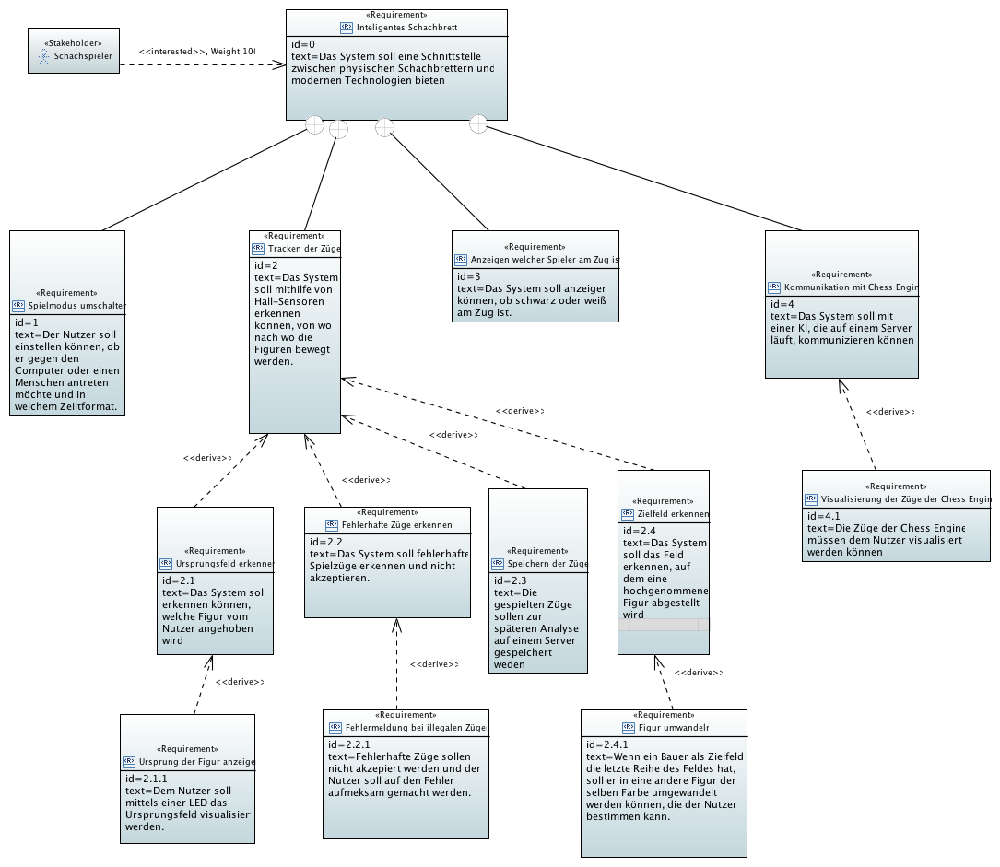
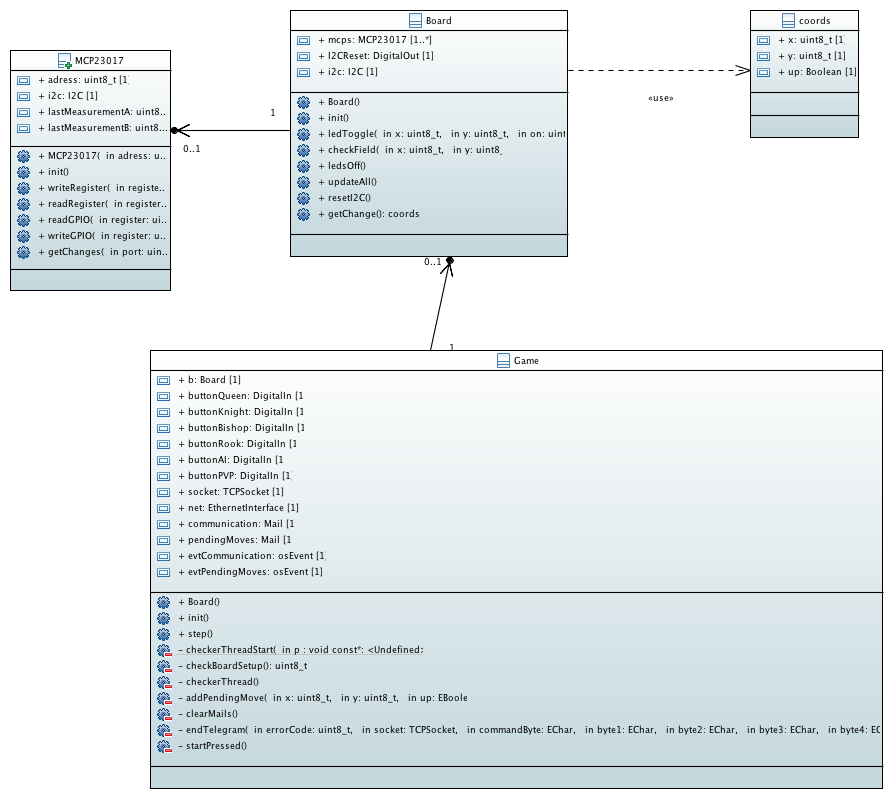
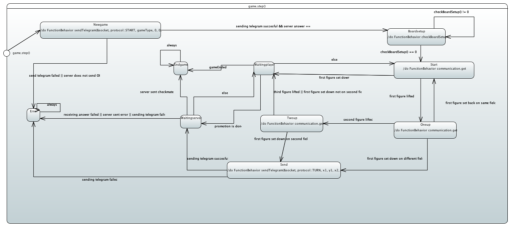
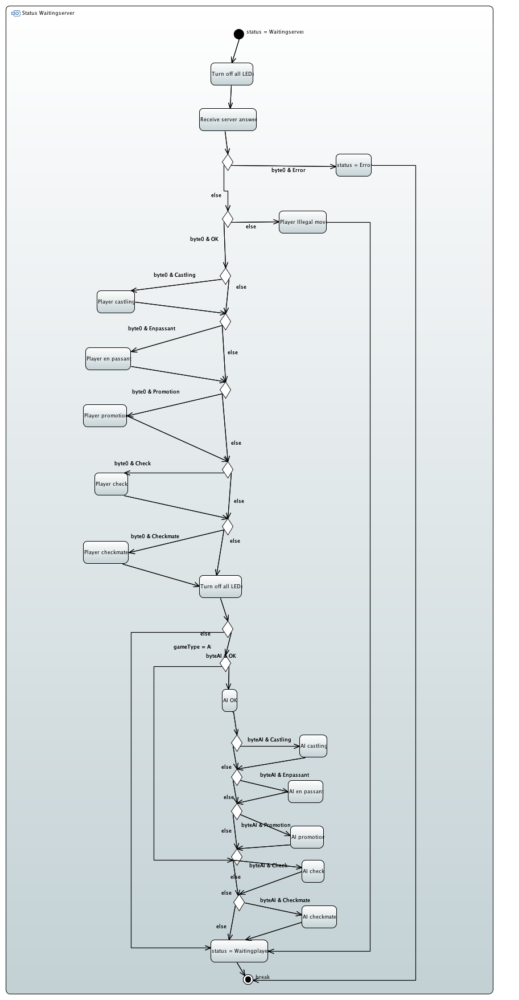

# intelligentes-schachbrett

## What is this?

The project "intelligentes-schachbrett" combines playing on a physical chessboard with modern engines.

The project consists of two parts:

- the actual physical chessboard which recognises moves through hall sensors and sends them to the server
- the server part, which evaluates and saves the played move, communicates with the engine and returns the evaluation and the move of the engine attached to it

## User manual

### Server

- The server must be set up on the IP address 192.168.2.1.

- Start the server.
- Type in the absolute path to the place, where the engine is stored. If you don't type in anything, the value of the constant 'path' of the class engineConstants will be used. The engine has to use the usi protocol.

### Client

- [Hardware Setup](#hardware)
- Choose the game mode by pressing the AI or PvP button.
- Place the figures on the start positions of a chess game.
  - The fields where a figure has to be placed are illuminated.
- Now you can start playing by moving the figures
  - an LED shines where you lifted and put a figure
  - if you do an illegal turn the shining LEDs show you how to reverse it
- If you are playing against the engine, the shining LEDs show you which move the AI did after your move. You then have to do the move as shown.

## System architecture

## Requirements

## Server

### Javadoc

[javadoc](https://iot-lab-minden.github.io/intelligentes-schachbrett/ChessServer/doc/index.html)

### Class diagrams

#### Logic

#### Manager

### Activity diagram

### Sequence diagram

The sequence diagram pictures the start of a new game and the first turn. To watch the whole documentation of the communication protocol [click here](Documentation/Definition of the communication protocol.md).

## Client

### Doxygen

[doxygen](https://iot-lab-minden.github.io/intelligentes-schachbrett/nucleo/doc/html/index.html)

### Class diagram

### Statemachine

The given statemachine describes the progress of playing a chess game. The game.step-method which is the startingpoint of the statemachine gets started in the micrcontroller's main-method.

#### Activity diagram

The following activity diagram further describes the waitingserver-status of the statemachine.

## Hardware Setup

### Building 

#### TLE 4905L

The TLE 4905L works with a Supply Voltage from 3.7V - 24V and has 3 pins which need to be Connected. According to the Documentation the pins are as following:

1. Vs
2. GND
3. Q

The Sensor outputs a Digital Signal when a Magnetfield is present which has the right polarisation. Because the pins are quite small and not easy to connect with a normal Jumperwire so we recommend soldering either all Vs wires together and also all Ground wires and solder a pin for  connecting to a Breadboard.

#### MCP23017

The MCP23017 works with a SupplyVoltage of 1.7V - 5.5V and has 28 pins. This IC is instructed via I2C and has 2 Ports each with 8 Pins. 

| PINs  | Connection |
| ----- | ---------- |
| 1-8   | PORTB      |
| 9     | VCC        |
| 10    | GND        |
| 12    | SCK        |
| 13    | SDA        |
| 15    | A0         |
| 16    | A1         |
| 17    | A2         |
| 21-28 | PORTA      |

### Connecting the Microcontroller

Connect the microcontroller with the network or computer with the help of an ethernet cable. There is no need for a specific crossover cable.

Should the microcontroller not have been connected with wires to the hardware, connect all wires according to the table below.

| Connector / Pin | Wire Connection    |
| --------------- | ------------------ |
| CN8 / VCC       | Vs                 |
| CN8 / GND       | GND                |
| CN8 / PD_2      | Display Enable     |
| CN8 / PG_2      | Display Read/write |
| CN8 / PG_3      | Display Reset      |
| CN9 / PD_7      | Display D4         |
| CN9 / PD_6      | Display D5         |
| CN9 / PD_5      | Display D6         |
| CN9 / PD_4      | Display D7         |
| CN9 / PG_1      | Not Reset MCP23017 |
| CN7 / PB_8      | I2C Clock          |
| CN7 / PB_9      | I2C Data           |

After connecting all wires according to the table you can supply power to the circuit.

## Site notice

*This project is part of the 2018 Embedded Software event at the FH Bielefeld University of applied sciences Bielefeld - campus Minden* 
[IoTLab](https://www.iot-minden.de/)