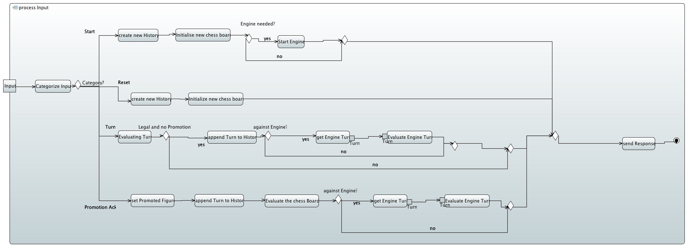

# intelligentes-schachbrett

## What is this?

The project "intelligentes-schachbrett" combines playing on a physicall chessbord with modern engines.

The Project consists of to parts:

- the actuall physicall chessboard witch recognises moves through hall sensors and sends them to the server
- the server part witch evaluates and saves the played move, communicates with the engine and returns the evaluation and the move of the engine attached to it.

## System architecture

## Server

### Manual

- start Server
- type in the absolute path to the place where the engine in stored. If you don't type in anything the value of the constant path of the class engineConstants will be used. The engine has to use the usi protocoll
- send a start command to the server
  - all commands the server understands are described in the protocol documentation in the documentation folder.

### Javadoc

[javadoc](https://iot-lab-minden.github.io/intelligentes-schachbrett/ChessServer/doc/index.html)

### Class diagrams

#### Logic

#### Manager

### Activity diagram

### Sequence diagram

The sequence diagram pictures the start of a new game and the first turn.

*This project is part of the 2018 Embedded Software event at the University of applied sciences Bielefeld - campus Minden* 
[IoTLab](https://www.iot-minden.de/)

## Hardware Setup

### Building 

#### TLE 4905L

The TLE 4905L works with a Supply Voltage from 3.7V - 24V and has 3 pins which need to be Connected. According to the Documentation the pins are as following:

1. Vs
2. GND
3. Q

The Sensor outputs a Digital Signal when a Magnetfield is present which has the right polarisation. Because the pins are quite small and not easy to connect with a normal Jumperwire so we recommend soldering either all Vs wires together and also all Ground wires and either solder a pin for  connecting to a Breadboard.

#### MCP23017

The MCP23017 works with a SupplyVoltage of 1.7V - 5.5V and has 28 pins. This IC is instructed via I2C and has 2 Ports each with 8 Pins. 

| PINs  | Connection |
| ----- | ---------- |
| 1-8   | PORTB      |
| 9     | VCC        |
| 10    | GND        |
| 12    | SCK        |
| 13    | SDA        |
| 15    | A0         |
| 16    | A1         |
| 17    | A2         |
| 21-28 | PORTA      |

### Changing Settings in Code

to create the TCP Connection with the Server there has to be made some changes to the Const.h. The constant Variables have to be modified to ensure creating a Connection with the correct Server.

- IP Server : IPv4 Adress of the Server
- Port Server : the Port on which the Server is Running

### Connecting the Microcontroller

Connect the Microcontroller with the Network or Computer with the help of a Ethernet Cable. There is no need for a specific Cross-Over cable.

Should the Microcontroller not have been connected with Wires to the Hardware. Connect all Wires According to the Table below.

| Connector / Pin | Wire Connection    |
| --------------- | ------------------ |
| CN8 / VCC       | Vs                 |
| CN8 / GND       | GND                |
| CN8 / PD_2      | Display Enable     |
| CN8 / PG_2      | Display Read/write |
| CN8 / PG_3      | Display Reset      |
| CN9 / PD_7      | Display D4         |
| CN9 / PD_6      | Display D5         |
| CN9 / PD_5      | Display D6         |
| CN9 / PD_4      | Display D7         |
| CN9 / PG_1      | Not Reset MCP23017 |
| CN7 / PB_8      | I2C Clock          |
| CN7 / PB_9      | I2C Data           |

After connecting all wires according to the table you can supply power to the Circuit.